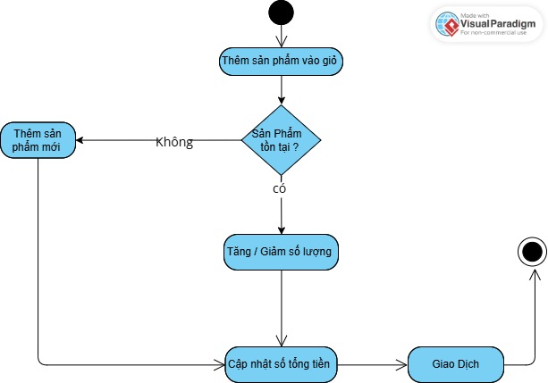

# 🐾 **Ứng Dụng Quản Lý Cửa Hàng Bán Vàng**  

#### 💻 **Java OOP Project** – Nhóm: `00P_N05_T3_2025_GROUP_VY_TRUONG_NAM`  

#### 🎓 **Môn học:** Lập trình Hướng Đối Tượng (OOP)  

#### 👩‍🏫 **Giảng viên hướng dẫn:** Nguyễn Lệ Thu  

## 🔰 Giới thiệu dự án

Ứng dụng Quản lý Vang Store được phát triển nhằm hỗ trợ cửa hàng vàng trong việc:

- Quản lý thông tin sản phẩm

- Quản lý dữ liệu khách hàng

- Theo dõi và xử lý giao dịch bán hàng

Giải pháp này giúp nâng cao hiệu quả, giảm thiểu sai sót, và tiết kiệm thời gian quản lý.

## 🔧 Chức năng chính

✅ Quản lý danh mục sản phẩm

✅ Quản lý thông tin khách hàng

✅ Quản lý và thống kê giao dịch bán vàng

✅ Ghi nhận lịch sử giao dịch

## 🖥️ Tổng quan giao diện

<h2 align="center">🏠 Giao diện Trang chủ</h2>

---

<h2 align="center">📦 Giao diện Sản phẩm</h2>

---

<h2 align="center">👤 Giao diện Khách hàng</h2>

---

<h2 align="center">🛒 Giao diện Giỏ hàng</h2>

---

<h2 align="center">💰 Giao diện Giao dịch</h2>

---

<h2 align="center">📜 Giao diện Lịch sử</h2>

---

<h2 align="center">🧾 Giao diện Hóa đơn</h2>

## 🏗️ Kiến trúc & Mô hình hoạt động

🔹 Hình 1: Sơ đồ lớp (Class Diagram)

Mô tả mối quan hệ giữa 3 thực thể chính: Khách hàng, Sản phẩm, Giao dịch

Quy trình đặt hàng 

🔹 Hình 2: Sơ đồ thuật toán GoldShopPNJ ( Mennu Phương Thức cốt lõi )

## 📦 Chi tiết các thành phần

### 🔑 GoldShopPNJ ( Cốt Lõi )

Thuộc tính: 

- Scanner scanner – nhập liệu từ bàn phím.

-  NumberFormat nf – định dạng tiền tệ VN.

- QuanLySanPham qlSP – quản lý danh sách sản phẩm.

- QuanLyKhachHang qlKH – quản lý danh sách khách hàng.

-  QuanLyGiaoDich qlGD – quản lý danh sách giao dịch.

-  GioHang gioHang – giỏ hàng hiện tại (tạo giao dịch từ đây).

  Phương Thức:

 -  void main(String[] args) – vòng lặp chương trình, điều hướng menu.

 -  void hienThiMenu() – in menu chính.

 -   void menuSanPham() – menu con quản lý sản phẩm (CRUD).

 -   void menuKhachHang() – menu con quản lý khách hàng (CRUD).

 -   void menuGiaoDich() – menu con  quản lý giao dịch (CRUD).

 -    void menuGioHang() – menu giỏ hàng.

### 👥 khách hàng

Thuộc tính:

- TenKH : String

- MaKH : String

- SDT : Double

Phương thức:

- void () : Thêm khách hàng mới

- void () : Xóa khách hàng

- void () : Sửa Khách hàng

- void () : Hiển thị danh sách

🔹 Hình 3 : Sơ Đồ Thuật Toán Khách Hàng 

  
  

### 🛒 Giỏ Hàng ( Phương Thức Phụ )

Thuộc tính :

- danh sách dòng Sản Phẩm trong giỏ

Phương Thức:

- lấy danh sách Sản Phẩm (để hiển thị)

- void () :thêm vào giỏ (nếu đã có thì cộng dồn).

- void () : đặt lại số lượng của sản phẩm.

- void () : xóa sản phẩm khỏi giỏ.

- double () :tổng tiền = Σ(giá * số lượng).

🔹 Hình 4 : Sơ đồ thuật toán Sản Phẩm

  

### 🛍️ Sản phẩm
Thuộc tính:

- MaSP : String

- TenSP : String

- GiaSP : double

- Anh : String

Phương thức:

- void () : Thêm sản phẩm

- void () : Xóa sản phẩm

- void () : Sửa sản phẩm

- void () : Hiển thị danh sách

🔹 Hình 5 : Sơ Đồ Thuật Toán Giỏ Hàng
  
 
 
🔹 Hình 6 : Sơ Đồ Thuật Toán Giao Dịch
  

### 💱 Giao dịch
Thuộc tính :
  
- TenKH : String

- MaKH : String

- SDTKh : String

- SDT : Double

Phương thức :
 
 - void () :calculate ( Tong tien).

- void () : display.

- Hiện thị thông tin giao dịch.

✅ Kết luận

- Ứng dụng Quản lý SHOP GOLD mang lại một giải pháp hiệu quả cho cửa hàng vàng, giúp:

- Tối ưu hóa hoạt động quản lý

- Tăng tính chuyên nghiệp

- Đảm bảo chính xác và minh bạch trong giao dịch

  👨‍💻 Thành viên nhóm

| Họ và tên             | Mã số SV  | GitHub Username         |
|------------------------|-----------|--------------------------|
| Nguyễn Đức Trường      | 24100336  | [ductruong02](https://github.com/ductruong02) |
| Nguyễn Hoàng Nam       | 24100136  | [NguyenHoangNam47](https://github.com/NguyenHoangNam47) |
| Phạm Thảo Hiền Vy      | 24100439  | [ptthvy](https://github.com/ptthvy) / [ptthv](https://github.com/ptthv) |

🔗 Liên kết dự án

- 📁 Repository GitHub:
github.com/ptthvy/00P_N05_T3_2025_GROUP_VY_TRUONG_NAM

- Link Public Codespaces: https://fantastic-palm-tree-jjqwg96jv775fr7.github.dev/
  
- 🌐 Link Public App:
GoldShop (GitHub Dev) :https://fantastic-palm-tree-jjqwg96jv775fr7-8080.app.github.dev/goldshop

- 📽️ Video Demo Team: https://youtu.be/yBaBjz35ens
