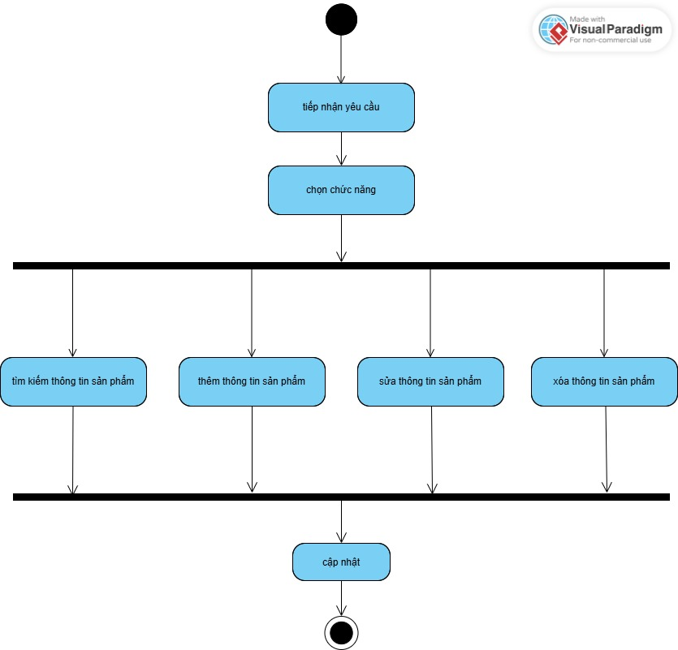

#00P_N05_T3_2025_GROUP_VY_TRUONG_NAM

Ứng dụng Quản lý Vang Store
* Đối tượng
  - Sản Phẩm
  - Khách Hàng
  - Giao Dịch
  - 
Xây dựng ứng dụng Quản lí cửa hàng bán Vàng

So Do Chuc Nang 

So Do hoat dong 

1. Khách Hàng
   TenKH : STring

   MaKH:String

   SDT: doulbe
   
 Phuong Thuc 
 
- Thêm khách hàng mới
  
- Hiển thị danh sách khách hàng
  
- Sửa thông tin khách hàng
  
- Xóa khách hàng
  Sơ đồ hoạt động
  

 2. Sản Phẩm
    
    MaSP :Sring
    
    LoaiSP: String

    GiaSP: double

    Phuong Thuc
    
- Thêm sản phẩm vàng
  
- Hiển thị danh sách sản phẩm
  
- Sửa thông tin sản phẩm
  
- Xóa sản phẩm

So Do San Pham 

3. Giao Dịch
   
   MaDG:String

   TenKH:String 

   MaSP : đã mua

   Phuong Thuc
   
- Tạo giao dịch bán hàng giữa khách hàng và sản phẩm
  
- Hiển thị danh sách giao dịch
  
- Tính tổng số lượng mua bán theo mã khách hoặc mã sản phẩm

