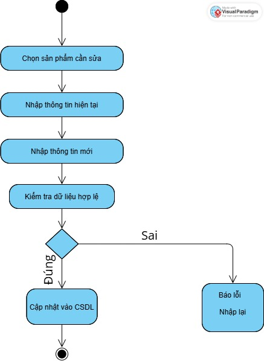

#00P_N05_T3_2025_GROUP_VY_TRUONG_NAM

## 🔰 Giới thiệu dự án

Ứng dụng Quản lý Vang Store được phát triển nhằm hỗ trợ cửa hàng vàng trong việc:

- Quản lý thông tin sản phẩm

- Quản lý dữ liệu khách hàng

- Theo dõi và xử lý giao dịch bán hàng

Giải pháp này giúp nâng cao hiệu quả, giảm thiểu sai sót, và tiết kiệm thời gian quản lý.

## 🔧 Chức năng chính

✅ Quản lý danh mục sản phẩm

✅ Quản lý thông tin khách hàng

✅ Quản lý và thống kê giao dịch bán vàng

3.Xây dựng ứng dụng Quản lý SHOP GOLD

## 🏗️ Kiến trúc & Mô hình hoạt động

🔹 Hình 1: Sơ đồ lớp (Class Diagram)

Mô tả mối quan hệ giữa 3 thực thể chính: Khách hàng, Sản phẩm, Giao dịch

🔹 Hình 2: Sơ đồ thuật toán - Đặt hàng

Quy trình đặt hàng của khách

## 📦 Chi tiết các thành phần
🧍‍♂️ Khách hàng

Thuộc tính:

- TenKH : String

- MaKH : String

- SDT : Double

Phương thức:

- Thêm khách hàng mới

- Xóa khách hàng

- Sửa Khách hàng

- Hiển thị danh sách khách hàng

🔹 Hình 3: Sơ đồ CURD Khách Hàng 

📦 Sản phẩm

Thuộc tính:

- MaSP : String

- TenSP : String

- GiaSP : Double

- AnhSP : String

Phương thức:

- Thêm sản phẩm

- Hiển thị danh sách sản phẩm

- Sửa thông tin sản phẩm

- Xoá sản phẩm

🔹 Hình 4: Sơ Đồ Thuật Toán Create Sản Phẩm 

🔹 Hình 5: Sơ Đồ Thuật Toán Update Sản Phẩm

 
 
🔁 Giao dịch

Thuộc tính:

- MaDG : String

- TenKH : String

- MaSP : Sản phẩm đã mua

Phương thức:

- Tạo giao dịch

- Hiển thị danh sách giao dịch

- Thống kê số lượng mua theo mã khách hoặc mã sản phẩm

🔹 Hình 6: Sơ Đồ Thuật Toán Read Giao Dịch 

✅ Kết luận

- Ứng dụng Quản lý SHOP GOLD mang lại một giải pháp hiệu quả cho cửa hàng vàng, giúp:

- Tối ưu hóa hoạt động quản lý

- Tăng tính chuyên nghiệp

- Đảm bảo chính xác và minh bạch trong giao dịch

  👨‍💻 Thành viên nhóm

| Họ và tên             | Mã số SV  | GitHub Username         |
|------------------------|-----------|--------------------------|
| Nguyễn Đức Trường      | 24100336  | [ductruong02](https://github.com/ductruong02) |
| Nguyễn Hoàng Nam       | 24100136  | [NguyenHoangNam47](https://github.com/NguyenHoangNam47) |
| Phạm Thảo Hiền Vy      | 24100439  | [ptthvy](https://github.com/ptthvy) / [ptthv](https://github.com/ptthv) |

🔗 Liên kết dự án

- 📁 Repository GitHub:
github.com/ptthvy/00P_N05_T3_2025_GROUP_VY_TRUONG_NAM

- 🌐 Link Public App:
GoldShop (GitHub Dev) :https://fantastic-palm-tree-jjqwg96jv775fr7-8080.app.github.dev/goldshop

- 📽️ Video Demo Team:
